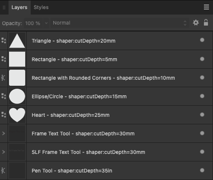

# **Note: This project is not affiliated with Shaper Tools.**

# Affinity Designer 2 and Shaper Origin/Studio Integration Tools

This repository contains two tools for working with SVG files between Affinity Designer 2 (AD2) and Shaper Studio:

- `ad2so.py`: Converts AD2 SVG files to Shaper Origin format
- `ss2ad.py`: Converts Shaper Studio SVG files back to AD2 format

## ad2so.py - AD2 to Shaper Origin Converter

`ad2so.py` applies Shaper Origin attributes to an Affinity Designer 2 exported SVG file. This tool was inspired by the Shaper Community forum thread [Depth encoding via Fusion360 (PLEASE LOCK THREAD)](https://community.shapertools.com/t/depth-encoding-via-fusion360-please-lock-thread/10075)

### Specifing Attributes in Affinity Designer 2

To specify a Shaper Origin attribute, the attribute name and value is added to the objects layer name in Affinity Designer 2. Example:



When AD2 exports to SVG, the layer name is used as the id of the element and attribute serif:id is added with the layer name. Example:

    <path id="Triangle---shaper:cutDepth-20mm" serif:id="Triangle - shaper:cutDepth=20mm" d="M1258.58,113.386L1383.31,340.157L1133.86,340.157L1258.58,113.386Z" style="fill:rgb(231,232,233);"/>

When processing the AD2 exported SVG file, ad2so.py searches each element for all occurances of shaper: in the serif:id attribute. If found, the shaper: attribute(s) is added to the element.<br>
Example (scroll all the way to the right to see the shaper: attribute):

    <path id="Triangle---shaper:cutDepth-20mm" serif:id="Triangle - shaper:cutDepth=20mm" d="M1258.58,113.386L1383.31,340.157L1133.86,340.157L1258.58,113.386Z" style="fill:rgb(231,232,233);" shaper:cutDepth="20mm" />

### Affinity Designer 2 Groups

Shaper Origin attributes can be set at the group level. The attributes only apply to that group of elements. Shaper: attributes specified on a specific layer will override the group level shaper: attributes.

**Group Notes:** 

- Frame Text Tool layers must be in a group for shaper: attributes to be specified for the text.
- If a group is within a group, the shaper: attribute has to applied to the group name that contains the objects.

Example: 


### Global Attributes

Shaper Origin attributes can be set at the global level. Global attributes are added to each element prior to shaper: attributes in AD2. Global attributes are specified on the command line. See below for more information. 

### Processing

Processing is performed by executing the Python script with command line options. The command line options are as follows:  

    options:
        -h, --help            show this help message and exit
        -i INFILE, --inFile INFILE
                        input SVG file (supports wildcards like *.svg)
        -o OUTFILE, --outFile OUTFILE
                        output SVG file or directory (required for single file,
                        optional for wildcards)
        -g [GBLATTR ...], --gblAttr [GBLATTR ...]
                        input global shaper attributes (optional)

Example invocations: 

    Single file processing:
        python3 ad2so.py -i Example.svg -o Example-Converted.svg      

    With global attributes:
        python3 ad2so.py -i Example.svg -o Example-Converted.svg -g shaper:cutDepth=15mm

    Multiple global attributes:
        python3 ad2so.py -i Example.svg -o Example-Converted.svg -g shaper:cutDepth=15mm shaper:futureAttr=welcome

    Process multiple files using wildcards:
        python3 ad2so.py -i "*.svg"               # Creates *-converted.svg for each file
        python3 ad2so.py -i "*.svg" -o output_dir # Saves converted files in output_dir

## ss2ad.py - Shaper Studio to AD2 Converter

`ss2ad.py` converts Shaper Studio SVG files back to Affinity Designer 2 format. It takes any shaper: attributes in the SVG file and concatenates them into the ID field, making them readable in AD2's layer panel.

For example, it converts:

    <path d="..." shaper:cutDepth="20mm" shaper:cutType="outside" />

To:

    <path d="..." id="shaper:cutDepth=20mm shaper:cutType=outside" />

This preserves the Shaper Studio settings while making them visible and editable in AD2's layer panel.

## Usage

Both tools support similar command-line options:

### ad2so.py Options

    -h, --help            Show this help message and exit
    -i INFILE, --inFile INFILE
                         Input SVG file (supports wildcards like *.svg)
    -o OUTFILE, --outFile OUTFILE
                         Output SVG file or directory (required for single file,
                         optional for wildcards)
    -g [GBLATTR ...], --gblAttr [GBLATTR ...]
                         Input global shaper attributes (optional)

### ss2ad.py Options

    -h, --help            Show this help message and exit
    -i INFILE, --inFile INFILE
                         Input SVG file(s) from Shaper Studio. Supports wildcards (*, ?)
    -o OUTFILE, --outFile OUTFILE
                         Output path (optional). For single files, specifies output file.
                         For wildcards, must be a directory.

### Example Usage

Single file processing:
```bash
# Convert from AD2 to Shaper Origin
python3 ad2so.py -i Example.svg -o Example-Shaper.svg

# Convert from Shaper Studio back to AD2
python3 ss2ad.py -i Example-Shaper.svg -o Example-AD2.svg
```

Process multiple files using wildcards:
```bash
# Convert all SVG files to Shaper Origin format
python3 ad2so.py -i "*.svg"               # Creates *-converted.svg for each file
python3 ad2so.py -i "*.svg" -o output_dir # Saves converted files in output_dir

# Convert all Shaper Studio files back to AD2 format
python3 ss2ad.py -i "*.svg"               # Creates *-converted.svg for each file
python3 ss2ad.py -i "*.svg" -o output_dir # Saves converted files in output_dir
```

With global attributes (ad2so.py only):
```bash
# Single global attribute
python3 ad2so.py -i Example.svg -o Example-Converted.svg -g shaper:cutDepth=15mm

# Multiple global attributes
python3 ad2so.py -i Example.svg -o Example-Converted.svg -g shaper:cutDepth=15mm shaper:toolDia=0.25in
```

### Auto-naming Convention

When processing files, both programs automatically:
- Add "-converted" suffix to output filenames
- Skip any files that already have "-converted" in their name
- When using wildcards without -o, create files in the same directory as input
- When using wildcards with -o, save files in the specified directory

### Color to Cut Type Mapping (ad2so.py only)

The ad2so.py program automatically maps colors to Shaper cut types:
- Black → outside
- White → inside
- Grey → pocket
- None+Grey → online
- Dodger Blue → guide
- Red → anchor