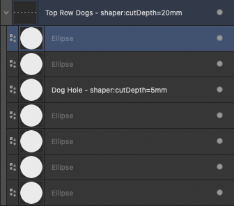

# ShaperOrigin
Python scripts for the Shaper Origin

## ad2so.py - Affinity Designer 2

ad2so.py applies Shaper Origin attributes to a Affinity Designer 2 exported SVG file.

### Specifing Attributes in Affinity Designer 2

To specify a Shaper Origin attribute, the attribute name and value is added to the objects layer name in Affinity Designer 2. Example:

When AD2 exports to SVG, the layer name is used as the id of the element and attribute serif:id is added with the layer name. Example:

    <path id="Triangle---shaper:cutDepth-20mm" serif:id="Triangle - shaper:cutDepth=20mm" d="M1258.58,113.386L1383.31,340.157L1133.86,340.157L1258.58,113.386Z" style="fill:rgb(231,232,233);"/>

When processing the AD2 exported SVG file, ad2so.py searches each element for all occurances of shaper: in the serif:id attribute. If found, the shaper: attribute(s) is added to the element. 
Example (scroll all the way to the right to see the shaper: attribute):

    <path id="Triangle---shaper:cutDepth-20mm" serif:id="Triangle - shaper:cutDepth=20mm" d="M1258.58,113.386L1383.31,340.157L1133.86,340.157L1258.58,113.386Z" style="fill:rgb(231,232,233);" shaper:cutDepth="20mm" />

### Affinity Designer 2 Groups

Shaper Origin attributes can be set at the group level. The attributes only apply to that group of elements. Shaper: attributes specified on a specific layer will override the group level shaper: attributes.

*Note: Frame Text Tool layers must be in a group for shaper: attributes to be specified for the text. 

Example: 

